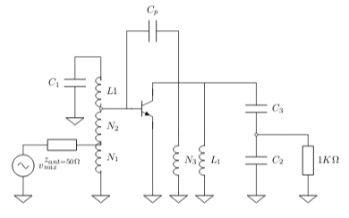
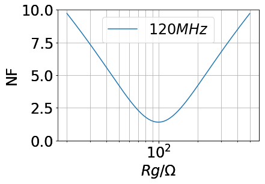
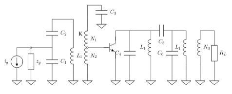
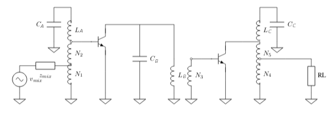
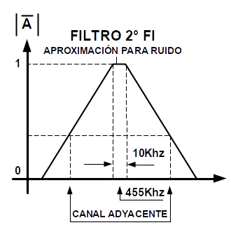
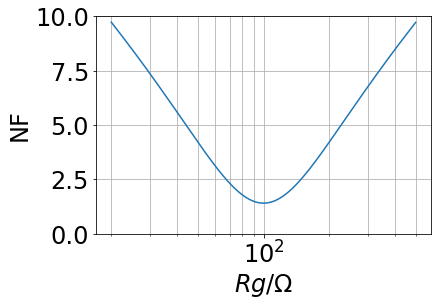
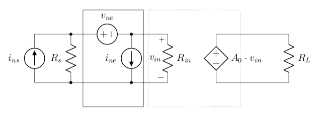

---
jupyter:
  jupytext:
    text_representation:
      extension: .Rmd
      format_name: rmarkdown
      format_version: '1.1'
      jupytext_version: 1.1.1
  kernelspec:
    display_name: Python 3
    language: python
    name: python3
---

```{python}
import numpy as np
import matplotlib.pyplot as plt
import scipy                  # http://scipy.org/
from scipy import signal
import cmath


import scipy                  # http://scipy.org/
from scipy import constants

from IPython.display import Image  
# %matplotlib inline
params = {'legend.fontsize': 24,
          'figure.figsize': (12, 8),
         'axes.labelsize': 24,
         'axes.titlesize': 24,
         'xtick.labelsize':24,
         'ytick.labelsize':24}
plt.rcParams.update(params) 


from IPython.display import Image
import sys 
sys.path.insert(0,'/home/aalmela/scm/git/utn/eaiii/2019/lib/')


```

```{python}
def Linvill(yt):
    y11 = yt[0,0]
    y12 = yt[0,1]
    y21 = yt[1,0]
    y22 = yt[1,1]
    C = (abs(y12*y21)+(y12*y21).real)/(2*y11.real*y22.real)
    print('###############  LINVILL   #####################')
    print( 'coeficiente de linvill C= {:4.2F}' .format(C))
    if C < 1:
        print( 'Es incondicionalmente estable')
    else :
        print( 'Es potencialmente inestable')
    return C

def Stern(yg, yl, yt):
    y11 = yt[0,0]
    y12 = yt[0,1]
    y21 = yt[1,0]
    y22 = yt[1,1]
    K = (2*(y11.real+yg.real)*(y22.real+yl.real)) / (abs(y12*y21)+(y12*y21).real)
    print('###############  STERN   #####################')
    print( 'coeficiente de stern K= {:4.2F}' .format(K))
    if K > 1:
        print( 'Estable')
    else :
        print( 'Inestable')
    return K


def neutraliza(yt,wo,Cn, N):
    Nn = (-yt[0,1].imag)/(wo*Cn)*N
    y11 =  wo*Cn*1j
    y12 =  wo*Cn*1j*(Nn/N)
    y21 =  wo*Cn*1j*(Nn/N)
    y22 =  wo*Cn*1j*(Nn/N)**2
    yn  = np.matrix([[y11, y12],[ y21, y22]])
    # cuadripolo resultante
    ytn  = yt + yn
    return (ytn,Nn)


def FTR(rg, Fopt, Ropt, Rn):
    return Fopt+(rg - Ropt)**2/(Rn*rg)
```

<!-- #region -->
El circuito de la figura corresponde a un receptor de Banda Aeronáutica ($118\,MHz$ a $137\,MHz$).  
Está sintonizado para recibir una señal AM de portadora de  $F_c = 120\,MHz$ y modulado al 50\%  por un tono único de $1\,KHz$. 
Se recibe a la salida del detector relación señal a ruido $SNR = 20\,dB$.


Los canales adyacentes se encuentran a $50\,KHz$ por arriba y debajo de la portadora de $120\,MHz$.


Una señal interferencia en la frecuencia imagen, con una amplitud $20\,dB$ por encima de la señal deseada (medida en bornes de antena), aparece a la entrada del detector $60\,dB$ por debajo de la deseada.

El receptor tiene una respuesta espuria en $119.09\,MHz$ con un rechazo de $60\,dB$ respecto de la portadora de $120\,MHz$.


Suponer que todos los elementos activos (Amplificadores, mezclador y detector) son lineales y de parámetros constantes dentro de toda la banda de interés. 


#### Circuitos

Para el diseño de los circuitos considerar los siguientes parámetros. 


|Frecuencia | $y_{ie}$          | $y_{re}$          | $y_{fe}$          | $y_{oe}$          | Unidad |
|-----------|-------------------|-------------------|-------------------|-------------------|--------|
|455 kHz    | $0.5 + j\, 0.05 $ | $ - j\, 0.001$    | $40 - j\, 0.1$    | $0.05 + j\, 0.01$ | mS     |
|10,7 MHz   | $1.0+j\, 2.0$     | $ - j\, 0.1$      | $40 - j\, 1.0$    | $0.1 + j\, 0.4$   | mS     |
|120 MHz    | $2.0+j\, 10.0$    | $ -0.1 - j\, 1.0$ | $30 - j\, 20$     | $0.5 + j\, 2$     | mS     |


Todos los tanques están adaptados a transferencia de energía a Q constate. Para los cálculos despreciar las capacidades del transistor solo si son despreciables respecto al capacitor de sintonía.  

##### Etapa RF.



La antena presenta una impedancia $R_{a}= 50 \Omega$ en toda la banda de interés y tiene una temperatura de ruido de $500\,K$. 


El transistor tiene una cifra de ruido optima de $1,5\,dB$, $R_{no} = 40 \Omega$ y una $R_{opt}= 100 \Omega$ con una corriente $I_{c} =  1\,mA$.  

$$F =    F_{opt} + 
\frac{1}{r_{no}} \cdot \frac{( r_{s}  - r_{opt})^2}{r_{s}} $$

 


Las bobinas empleadas para el amplificador de RF poseen : $Q_{oL} = 100$ y $N = 20$ espiras.
Capacitores con $Q_{oC} = \infty$. 


#### Etapa 1IF.


Primera FI (Amplificador + filtro): Dos etapas dobles sintonizadas sincrónicas con acoplamiento crítico

Los transistor presentan $3\,dB$ de cifra de ruido en el punto de operación.



Para el cálculo de estabilidad suponer comportamiento de simple sintonizado, empleando la impedancia que presenta el doble sintonizado (similar a el cálculo de adaptación).

Las bobinas empleadas para el amplificador de 1FI poseen : $Q_{oL} = 100$ y $N = 100$ espiras.
Capacitores con $Q_{oC} = \infty$.


#### Etapa 2IF.

Segunda FI: 3 etapas Simple Sintonizadas en configuración Butterworth, con frecuencia central de $455\,KHz$ y ancho de  banda $10\,KHz$. 



Los transistor presentan $2\,dB$ de cifra de ruido en el punto de operación. El ancho de banda equivalente puede ser calculado empleando la simplificación propuesta en la figura.





Las bobinas empleadas para el amplificador de 2FI poseen : $Q_{oL} = 120$ y $N = 300$ espiras.
Capacitores con $Q_{oC} = \infty$.


#### Mezcladores.

Primer oscilador local: senoide pura de $109.3\,MHz$.

Segundo OL: Senoide pura de $10.245\,MHz$.


Los parámetros del mezclador:

| Símbolo   | Parametro               | typ | Unidad    |
|-----------|-------------------------|-----|-----------|
| $f_{i}$   | Frecuencia de entrada   | 500 | MHz       |
| $f_{osc}$ | Frecuancia de oscilador | 200 | MHz       |
| $R_{in}$  | Resistencia de entrada  | 1   | $K\Omega$ |
| $R_{out}$ | Resistencia de salida   | 1   | $K\Omega$ |
| $G_{c}$   | Ganancia de conversión  | 12  | dB        |
| $NF $     | Cifra de ruido          |  4  | dB        |


#### Detector.

El detector presenta un rendimiento de detección del $0,7$. La resistencia dinámica del diodo es de $100\,\Omega$ y $R_{DC} = 10 K\Omega$. La cifra de ruido del detector es de $4 dB$.


<!-- #endregion -->

<!-- #region -->
###  Determine


1. Ancho de banda equivalente de ruido de la etapa de RF.

2.  Cifra de ruido total de la etapa para maxima transferencia de energia a Qte y Ganancia de potencia de la etapa.

3.  Cifra de ruido total de la etapa para minimizar el ruido y Ganancia de potencia de la etapa en la nueva condición. Calcular el factor de Stern para esta nueva condición.

4.  Componentes de la etapa de 1FI.

5.  Ancho de banda equivalente de ruido de la etapa de 1FI de cada sintonizado.
    
6.  Resistencia de entrada del detector y capacitor $C_{DC}$.

7.  Componentes de la etapa de 2FI.

8.  Ancho de banda equivalente de ruido de la etapa de 2FI.

9.  Factor de ruido del receptor empleando la condición de menor ruido.

10.  Nivel de señal a la entrada del receptor, idem anterior.


11. Para la etapa de RF, $Qc$ de los sintonizados para cumplir con la condición de filtros sincrónicos y $Q_{c2} = 2 \cdot Q_{c1} $  .

12. Dado que el transistor es potencialmente inestable ($C= 6.62$, coeficiente de Linvill), se propuso una red de neutralización. Calcular el número de espiras de la red de neutralización. Calcular los parámetros resultantes (transistor y red de neutralización) y el coeficiente de Stern resultante para la condición de máxima transferencia de energía a Q constante.   

13. El valor de los componentes de la etapa de RF.

14. Proponga alguna modificación para que la red sea de unilateralización, calcule los componentes de la nueva red y el coeficiente de Stern resultante.
 

  
15. Q y h de los resonadores de Primera FI

16. Calcular el coeficiente de Linvill. En caso de ser potencialmente inestable, proponer una red de neutralización.    
    
17. Calcular los parámetros resultantes (transistor y red de neutralización), teniendo en cuenta la red de neutralización en caso de ser necesaria, empleando $C_{p} = 5 pF$ y el coeficiente de Stern resultante para la condición de máxima transferencia de energía a Q constante.

18. Q y frecuencia central de cada uno de los resonadores de Segunda FI.

19. Calcular coeficiente de Linvill. En caso de ser potencialmente inestable, proponer una red de neutralización. Si es incondicionalmente estable, calcular el coeficiente de Stern para la condición de máxima transferencia de energía a Q constante.  

20. Rechazo de canal adyacente. 

<!-- #endregion -->

<!-- #region -->
# Respuestas

## 1.  Ancho de banda equivalente del amplificador de RF

#### Recordando el calculo del Q de los sintonizados de RF

$Q_{c2} = 2 \cdot Q_{c1} $  .

$\frac{1}{\sqrt{1+Q_1^2\cdot(\frac{fi}{fo}-\frac{fo}{fi})^2}} \cdot \frac{1}{\sqrt{1+Q_2^2\cdot(\frac{fi}{fo}-\frac{fo}{fi})^2}} = \frac{1}{10^{\frac{40}{20}}}$


$ - 99 + 5\cdot Q_1^2\cdot(0.1563) + 4\cdot Q_1^4\cdot(0.1563)^2 = 0$

$Q1 =  5.3$

$Q2 =  10.5$


#### Ancho de banda del amplificador de RF
El ancho e banda equivalente de ruido de un amplificador sintonizado se puede calcular a partir de la aproximación de banda angosta como:


$| \bar{H(f_{c})^2} |=\frac{1}{1+\chi^2}$

Donde: $\chi^2=\frac{2 Q}{f_{o}} \cdot (f-f_{o})$, entonces $df= \frac{f_{o}}{2Q}d\chi$. 

El ancho de banda equivalente para dos simples sintonizados sincronicos pero con distintos $Q$ se calcula de esta forma:

$B_{eq}=\int_{-\infty}^{\infty} \frac{1}{1+\chi_a^2} \cdot \frac{1}{1+\chi_b^2} \frac{f_{o}}{2Q}d\chi$

$B_{eq}=\int_{-\infty}^{\infty} \frac{1}{1+\chi_a^2} \cdot \frac{1}{1+4 \cdot \chi_a^2} \cdot \frac{f_{o}}{2Q}d\chi$

$B_{eq}=\int_{-\infty}^{\infty} \frac{1}{1+\chi_a^2} \cdot \frac{1}{1+4 \cdot \chi_a^2} \cdot \frac{f_{o}}{2Q}d\chi$

$B_{eq}= \frac{\pi \cdot fo}{6 \cdot Q_a}$

Este ancho de banda afecta a todas las fuentes de ruido en la entrada del amplificador.  

<!-- #endregion -->

```{python}
### Componentes
Qo   = 100                    # Q libre de los inductores
Q1   = 5                      # Del calculo 
Q2   = 10                     # Del calculo  
Ne   = 20                     # Numero de espiras total de los inductores
rl   = 1e3                    # Resistencia carga
rg   = 50                     # Resistencia del generador

fo   = 120e6                  # Frecuencia central 
wo   = 2*np.pi*fo             # wo
Cp   = 5e-12                  # Capacitor de la red de neutralización

# Parametros del transistor 120 MHz
y11 =   2.0e-3 + 10.0e-3*1j
y12 = - 0.1e-3 -  1.0e-3*1j
y21 =  30.0e-3 - 20.0e-3*1j 
y22 =   0.5e-3 +  2.0e-3*1j

# Uso una matriz para el manejo de los parametros del transistor
yt  = np.matrix([[y11, y12],[ y21, y22]])

# Calculo de n (ver función neutraliza() )
ytn, Np =  neutraliza(yt,wo,Cp,20)
print('El número de vueltas necesarias para el neutralizador Np: {:1.2f}'.format(Np))


# Resistencia de entrada y de salida
r11   =  1/ytn[0,0].real       # r11 
r22   =  1/ytn[1,1].real       # r22


# Parametros de ruido
Fopt = 3.55
Ropt = 120
Rn   = 49
Frf  =  FTR(r11, Fopt, Ropt, Rn)

# Para MTE Qte 
yl    = (ytn[1,1].real-ytn[1,1].imag*1j)
yg    = (ytn[0,0].real-ytn[0,0].imag*1j)


# Calculo de sintonizado de salida
rext = r22/2                  # Rexterna 
L1 = (1/Q2-1/Qo)*(rext)/wo    # Inductor 
C1 = 1/(wo**2*L1)             # Cap de sintonia 

# divisor Cap
# adapta de r22 a rl
Qm2   = r22 * wo * C1
#print(Qm2)
N     = (r22/rl)**0.5
Qm1   = Qm2/N
#print(Qm1)
C3 = C1*N
C2 = C1*N/(N-1)

print('L1 =  {:1.2e}F'.format(L1))
print('C1 =  {:1.2e}F'.format(C1))
print('C2 =  {:1.2e}F'.format(C2))
print('C3 =  {:1.2e}F'.format(C3))

# Sintonizado de  entrada
rt = 2/((1/Q1-1/Qo)/(L1*wo)) # Resistencia a tope de bobina

# 50/rt = (N1/N)^2
N1 = (rg/rt)**0.5  * Ne
N2 = (r11/rt)**0.5 * Ne 
#print(Ne)
#N2 = 20
print('N1 =  {:1.2f}'.format(N1))
print('N2 =  {:1.2f}'.format(N2 - N1))

```

```{python}
## Parametros de LTspice
## Calculo los inductores

Lp  = L1 *(Np/Ne)**2
L1a = L1 *(N1/Ne)**2   
L1b = L1 *(N2/Ne)**2   
L1c = L1 *((Ne-N1-N2)/Ne)**2   


# para usar en LTspice. Presionar s y pegar en el cuadro de dialogo.
# Los valores de los componentes se asignan entre llaves. 

## Para las simulaciones con LTspice
#gei = iei/1e-12

print('k1 L1a L1b 1')
print('k2 L1a L1c 1')
print('k3 L1b L1c 1')
print('k4 L1  Lp 1')


print('.param L1a = {:1.3e}'.format(L1a))
print('.param L1b = {:1.3e}'.format(L1b))
print('.param L1c = {:1.3e}'.format(L1c))
print('.param rp1 = {:1.3e}'.format(wo*L1*Qo))

print('.param C1 = {:1.3e}'.format(C1))


print('.param L1  = {:1.3e}'.format(L1))

print('.param Lp  = {:1.3e}'.format(Lp))
print('.param Cp = {:1.3e}'.format(Cp))
print('.param C2 = {:1.3e}'.format(C2))
print('.param C3 = {:1.3e}'.format(C3))


print('.param rg = {:1.3e}'.format(rg))
print('.param g11 = {:1.3e}'.format(ytn[0,0].real))

print('.param g12 = {:1.3e}'.format(ytn[0,1].real))
print('.param c12 = {:1.3e}'.format(ytn[0,1].imag/wo))
print('.param g21 = {:1.3e}'.format(ytn[1,0].real))
print('.param c21 = {:1.3e}'.format(ytn[1,0].imag/wo))

print('.param g22 = {:1.3e}'.format(ytn[1,1].real))
print('.param rl = {:1.3e}'.format(rl))
#print('.param gei = {:1.3e}'.format(gei))
```

<!-- #region -->
## 2. Cifra de ruido total de la etapa de RF.


El diseño del amplificador de RF se realizó para la condición de máxima transferencia de energía a Qcte. 

En esta condición el factor de ruido del transistor es $F = 8.7$.

Para un circuito sintonizado MTE cte, se demostro: 

$$P_{r_{11}} =  P_{avg} \frac{4  \cdot r_g \cdot r_{11} }{(r_g + r_{11})^2 }   \cdot (1 - \frac{ Q_c }{ Q_o })^2 $$ 

Si $r_{11} = r_{g} $ :

$$P_{r_{11}} =  P_{avg}  \cdot (1 - \frac{ Q_c }{ Q_o })^2 $$ 


Entonces la atenuación:
$$ L = \frac{1}{(1 - \frac{ Q_c }{ Q_o })^2} $$

Para estos circuitos el factor de ruido:

$$ T_e = T \cdot (L - 1 ) $$

$$ F  = k_B \cdot (T + T_e) \cdot B $$


La ganacia de potencia del circuito:

$$G =  P_{avs} \cdot \frac{4 \cdot r_{gb} \cdot r_{11}}{(r_{gb} + r_{11})^2}\cdot (1 - \frac{Q_c}{Q_o} )^2 $$ 

Si se desadapta para la condición de minima cifra de ruido, la ganancia de la etapa sera menor.

En el caso del ruido, $P_{avs}$ corresponde a la potencia de ruido disponible ($k_B B T$)
<!-- #endregion -->

<!-- #region -->

## Factor de ruido en amplificadores

El factor de ruido del transistor depende de la impedancia del generador presentado a la entrada del cuadripolo. 




Debido dificultad de modelar los efectos de ruido en semiconductores, se propone modelizar el ruido total por dos generadores, uno de tensión y otro de corriente colocados a la entrada del dispositivo y se considera el dispositivo libre de ruido. 
Luego, el fabricante mide el ruido generado por el dispositivo y encuentra que tensiones y corrientes de ruido deben aplicarse a la entrada para provocar ese ruido a la salida. 
Sin importar el fenómeno físico que genera el ruido, esta técnica permite cuantificarlo y modelarlo. 
Una forma de modelar el ruido de redes lineales de dos puertos es mediante dos generadores de ruidos correlacionados a la entrada del dispositivo \cite{Haus}, el esquema de este modelo es el siguiente:




La potencia de ruido en la salida: 


$$ P_{nt} = \frac{|A_v|^2}{r_l} \cdot ( ( \bar{e_{ne}} \cdot \frac{r_{in} }{r_{s} + r_{in} } )^2 + (\bar{i_{ne}} \cdot \frac{r_{in} \cdot r_{s}  }{r_{s} + r_{in} }  )^2 + (\bar{i_{ns}} \cdot \frac{r_{in} \cdot r_{s}  }{r_{s} + r_{in} }  )^2  )$$


$$ P_{nt} = \frac{|A_v|^2}{r_l} \cdot \frac{r_{in}^2 }{(r_{s} + r_{in})^2 } \cdot  (  \bar{e_{ne}}^2 + \bar{i_{ne}}^2 \cdot r_{s}^2 + \bar{i_{ns}}^2 \cdot r_{s}^2  + 2 \cdot \gamma \cdot \bar{i_{ne}} \cdot  \bar{e_{ne}} \cdot r_{s}  )$$


$$ P_{ns} = \frac{|A_v|^2}{r_l} \cdot \frac{r_{in}^2 \cdot r_{s}^2 }{(r_{s} + r_{in})^2 } \cdot  (\bar{i_{ns}}^2 \cdot r_{s}^2 )$$


$$ F = \frac{P_{nt}}{P_{ns}} =    \frac{\bar{e_{ne}}^2}{\bar{i_{ns}}^2 \cdot r_{s}^2 }  + \frac{\bar{i_{ne}}^2}{\bar{i_{ns}}^2 }  + \frac{\bar{i_{ns}}^2}{\bar{i_{ns}}^2 }  +  \frac{2 \cdot \gamma \cdot \bar{i_{ns}} \cdot  \bar{e_{ne}} \cdot}{\bar{i_{ns}}^2 \cdot r_{s} }  $$


$$ \bar{i_{ns}}^2 = 4 \cdot k_B \cdot T \cdot B \cdot \frac{1}{r_s}$$

$$ F =    1 + \frac{\bar{e_{ne}}^2}{\bar{i_{ns}}^2 \cdot r_{s}^2 }  + \frac{\bar{i_{ne}}^2}{\bar{i_{ns}}^2 }  +  \frac{2 \cdot \gamma \cdot \bar{i_{ne}} \cdot  \bar{e_{ne}} \cdot}{\bar{i_{ns}}^2 \cdot r_{s} }  $$
 
 
$$F =    1 + 
\frac{\bar{e_{ne}}^2}{4 \cdot k_B \cdot T \cdot B  \cdot r_{s} }  + 
\frac{\bar{i_{ne}}^2 \cdot r_{s} }{4 \cdot k_B \cdot T \cdot B}    + 
\frac{2 \cdot \gamma \cdot \bar{i_{ne}} \cdot  \bar{e_{ne}} \cdot}{4 \cdot k_B \cdot T \cdot B  } $$
  

### Resistencia de fuente optima de ruido
Buscamos el minimo para obtener la resistencia de fuente optima de ruido.

$$\frac{\partial F}{\partial r_s} = - \frac{\bar{e_{ne}}^2}{4 \cdot k_B \cdot T \cdot B  \cdot r_{s}^2 }  + 
\frac{\bar{i_{ne}}^2 }{4 \cdot k_B \cdot T \cdot B}   = 0$$

$$ r_{opt} = \frac{\bar{e_{ne}} }{\bar{i_{ne}} }$$


### Factor de ruido optimo
Replazando en la expresión de $F$, $r_{s} =  r_{opt} $ :


$$F_{opt} =    1 + 
\frac{\bar{e_{ne}}^2 \cdot \bar{i_{ne}} }{4 \cdot k_B \cdot T \cdot B  \cdot \bar{e_{ne}} }  + 
\frac{\bar{i_{ne}}^2 \cdot \bar{e_{ne}} }{4 \cdot k_B \cdot T \cdot B \cdot \bar{i_{ne}}}    + 
\frac{2 \cdot \gamma \cdot \bar{i_{ne}} \cdot  \bar{e_{ne}} \cdot}{4 \cdot k_B \cdot T \cdot B  } $$
  
$$F_{opt} =    1 + 
\frac{\bar{e_{ne}} \cdot \bar{i_{ne}} }{4 \cdot k_B \cdot T \cdot B   }  + 
\frac{\bar{i_{ne}} \cdot \bar{e_{ne}} }{4 \cdot k_B \cdot T \cdot B   }  + 
\frac{2 \cdot \gamma \cdot \bar{i_{ne}} \cdot  \bar{e_{ne}} \cdot}{4 \cdot k_B \cdot T \cdot B  } $$

El factor de ruido optimo se expresa como:
$$F_{opt} =    1 + 
\frac{\bar{e_{ne}} \cdot \bar{i_{ne}} }{2 \cdot k_B \cdot T \cdot B   } \cdot ( 1 +  \gamma ) $$

### Factor de ruido expresado en función de $ F_{opt}$ y $r_{opt}$

$$F =    1 + 
\frac{\bar{e_{ne}} \cdot \bar{i_{ne}} }{2 \cdot k_B \cdot T \cdot B  } \cdot ( 
\frac{\bar{e_{ne}}            }{2 \cdot \bar{i_{ne} \cdot r_{s}}    } + 
\frac{\bar{i_{ne}} \cdot r_{s}}{2 \cdot \bar{e_{ne}}     } + 
 \gamma )$$
 
 
$$F =    1 + 
\frac{\bar{e_{ne}} \cdot \bar{i_{ne}} }{2 \cdot k_B \cdot T \cdot B  } \cdot ( 1+ \gamma ) + 
\frac{\bar{e_{ne}} \cdot \bar{i_{ne}} }{2 \cdot k_B \cdot T \cdot B  } \cdot ( 
\frac{\bar{e_{ne}}            }{2 \cdot \bar{i_{ne} \cdot r_{s}}    } + 
\frac{\bar{i_{ne}} \cdot r_{s}}{2 \cdot \bar{e_{ne}}     }  - 1)$$ 


$$F =    F_{opt} + 
\frac{\bar{e_{ne}} \cdot \bar{i_{ne}} }{2 \cdot k_B \cdot T \cdot B  } \cdot ( 
\frac{\bar{e_{ne}}            }{2 \cdot \bar{i_{ne} \cdot r_{s}}    } + 
\frac{\bar{i_{ne}} \cdot r_{s}}{2 \cdot \bar{e_{ne}}     }  - 1)$$


Dondo como resultado:

$$F =    F_{opt} + 
\frac{1}{r_{no}} \cdot \frac{( r_{s}  - r_{opt})^2}{r_{s}} $$
<!-- #endregion -->
```{python}
# %matplotlib inline
# Factor de ruido en para esa impedancia
NFopt= 1.4
Fopt = 10**(NFopt/10)
Ropt = 100
Rn   = 40

### MTE Cte
Dm  = (4*r11*r11)/(r11+r11)**2 
Fm  = FTR(r11,Fopt,Ropt,Rn)
print('Para MTE Qct, la ganacia de la etapa: {:1.2f} y su factor de ruido: {:1.2f}'.format(Dm,Fm))

### Fopt
Do = (4*Ropt*r11)/(Ropt+r11)**2 
Fo  = FTR(Ropt,Fopt,Ropt,Rn)
print('Para MTE Qct, la ganacia de la etapa: {:1.2f} y su factor de ruido: {:1.2f}'.format(Do,Fo))

## Para los gráficos
x = np.linspace(40,400,361) 
plt.plot(x, (4*x*r11)/(x+r11)**2)
plt.show()
plt.plot(x, 10*np.log10(FTR(x,Fopt,Ropt,Rn)))
plt.show()
```

```{python}
## Recalculando para Fopt
rgb  = Ropt

Frf  =  FTR(rgb, Fopt, Ropt, Rn)

# Si se supone como unilateral, el calculo del sintonizado de salida no se ve afectado. 
# De otra manera, yo = y22 - y12 y21/(y11 yg)
# Suponemos unilateral

# Sintonizado de  entrada

rt = 2/((1/Q1-1/Qo)/(L1*wo)) # Resistencia a tope de bobina

# 50/rt = (N1/N)^2
N1 = (rg/rt)**0.5  * Ne
N2 = (rgb/rt)**0.5 * Ne 
print(Ne)
#N2 = 20
print('N1 =  {:1.2f}'.format(N1))
print('N2 =  {:1.2f}'.format(N2 - N1))


```

```{python}
## Parametros de LTspice
## Calculo los inductores

Lp  = L1 *(Np/Ne)**2
L1a = L1 *(N1/Ne)**2   
L1b = L1 *(N2/Ne)**2   
L1c = L1 *((Ne-N1-N2)/Ne)**2   


# para usar en LTspice. Presionar s y pegar en el cuadro de dialogo.
# Los valores de los componentes se asignan entre llaves. 

## Para las simulaciones con LTspice
#gei = iei/1e-12

print('k1 L1a L1b 1')
print('k2 L1a L1c 1')
print('k3 L1b L1c 1')


print('.param L1a = {:1.3e}'.format(L1a))
print('.param L1b = {:1.3e}'.format(L1b))
print('.param L1c = {:1.3e}'.format(L1c))
print('.param rp1 = {:1.3e}'.format(wo*L1*Qo))

print('.param C1 = {:1.3e}'.format(C1))


print('.param L1  = {:1.3e}'.format(L1))

print('.param Lp  = {:1.3e}'.format(Lp))
print('.param Cp = {:1.3e}'.format(Cp))
print('.param C2 = {:1.3e}'.format(C2))
print('.param C3 = {:1.3e}'.format(C3))


print('.param rg = {:1.3e}'.format(rg))
print('.param g11 = {:1.3e}'.format(ytn[0,0].real))

print('.param g12 = {:1.3e}'.format(ytn[0,1].real))
print('.param c12 = {:1.3e}'.format(ytn[0,1].imag/wo))
print('.param g21 = {:1.3e}'.format(ytn[1,0].real))
print('.param c21 = {:1.3e}'.format(ytn[1,0].imag/wo))

print('.param g22 = {:1.3e}'.format(ytn[1,1].real))
print('.param rl = {:1.3e}'.format(rl))
#print('.param gei = {:1.3e}'.format(gei))
```


4. Doble sintonizado

Para el analisis se emplea la respuesta en frecuencia :

$$A(S) = \frac{-S gm M w_o^4  }{(s^2+s\frac{w_o}{Q_o}+w_o^2)(s^2+s\frac{w_o}{Q_o}+w_o^2)-k^2 w_o^4 }$$ 

$$\chi = 2Q\frac{ (w - w_o) }{ w_o}$$

$$A(\chi) = \frac{j gm M w_o Q^2  }{(1+j(\chi+h))(1+j(\chi-h)) }$$ 

$$A(\chi_o) = \frac{j gm M w_o Q^2  }{(1+j(h))(1+j(h)) } = \frac{j gm M w_o Q^2  }{(1+h^2) }$$ 

$$\bar{A}(\chi) = \frac{A(\chi)}{A(\chi_o)} = \frac{1+h^2 }{ (1+j(\chi+h))(1+j(\chi-h)) }$$ 

$$| \bar{A}(\chi) | =  \frac{1+h^2 }{\sqrt{\chi^4+2\chi^2(1-h^2)+(1+h^2)^2} }$$ 


```{python}
def DDS(f,fo,Q,h):
    X = 2 * Q * (f-fo)/fo 
    return (1+h**2)/(X**4 + 2*X**2*(1-h**2)+ (1+h**2)**2)**(1/2)


fo = 120e6
wo = 2* np.pi*fo

X = ((10**3-1)**(2)*4)**(1/4)
print(X)
Q = X*fo/2/(10.7e6*2)
print(Q)
h = 1
# %matplotlib notebook
fo = 120e6
wo = 2* np.pi*fo
 
f = np.linspace(114e6,124e6,201)

plt.semilogy(f, DDS(f,fo,Q,h)**2)

plt.grid(which='both')
```

5. Q y h de los resonadores de Primera FI.

En segunda FI, la frecuencia imagen esta en $97.9\,MHz$, que corresponde a la frecuencia de $119.09\,MHz$.

$\frac{1}{1+\frac{\chi^4}{4}} = \frac{1}{10^{\frac{60}{20}}}$


```{python}
fo = 10.7e6
wo = 2* np.pi*fo

X = ((10**3-1)*4)**(1/4)

print(X)

Q = X*fo/2/(fo-9.79e6)

print(Q)

h = 1
```

6. Calcular el coeficiente de Linvill. En caso de ser potencialmente inestable, proponer una red de neutralización.

```{python}
fo = 10.7e6
wo = 2*np.pi*fo


y11 =   1.00e-3 + 2.00e-3*1j
y12 = - 0.00e-3 - 0.10e-3*1j
y21 =  40.00e-3 - 1.00e-3*1j 
y22 =   0.10e-3 + 0.400e-3*1j

yt  = np.matrix([[y11, y12],[ y21, y22]])

Linvill(yt)


```

7. Calcular los parámetros resultantes (transistor y red de neutralización), teniendo en cuenta la red de neutralización en caso de ser necesaria, empleando $C_{p} = 5 pF$ y el coeficiente de Stern resultante para la condición de máxima transferencia de energía a Q constante.

```{python}
# Calculo de n
ytn, Np =  neutraliza(yt,wo,5e-12,100)
print(Np)

print(ytn)

yl= (ytn[1,1].real-ytn[1,1].imag*1j)

yg = (ytn[0,0].real-ytn[0,0].imag*1j)


```

8. Q y frecuencia central de cada uno de los resonadores de Segunda FI.


```{python}
fo = 455e3
wo = 2*np.pi*fo
bw = 10e3

Q1 = fo/bw /(np.sin( (2*1-1)*np.pi/(2*3) ) )
f1 = fo + bw/2*np.cos((2*1-1)*np.pi/(2*3) ) 

Q2 = fo/bw /(np.sin( (2*2-1)*np.pi/(2*3) ) )
f2 = fo + bw/2*np.cos((2*2-1)*np.pi/(2*3) ) 

Q3 = fo/bw /(np.sin( (2*3-1)*np.pi/(2*3) ) )
f3 = fo + bw/2*np.cos((2*3-1)*np.pi/(2*3) ) 


print(Q1,Q2,Q3)
print(f1,f2,f3)
```

9. Calcular coeficiente de Linvill. En caso de ser potencialmente inestable, proponer una red de neutralización. Si es incondicionalmente estable, calcular el coeficiente de Stern para la condición de máxima transferencia de energía a Q constante. 

```{python}
fo = 455e3
wo = 2*np.pi*fo


y11 =   0.50e-3 + 0.050e-3*1j
y12 = - 0.00e-3 - 0.001e-3*1j
y21 =  40.00e-3 - 0.100e-3*1j 
y22 =   0.05e-3 + 0.010e-3*1j

yt  = np.matrix([[y11, y12],[ y21, y22]])

Linvill(yt)


```

10. Rechazo de canal adyacente. 


```{python}
fca = fo + 50e3 

A1 = 1/(1+Q1**2*(fca/f1-f1/fca )**2 )**0.5
A2 = 1/(1+Q2**2*(fca/f2-f2/fca )**2 )**0.5
A3 = 1/(1+Q3**2*(fca/f3-f3/fca )**2 )**0.5

A = A1 * A2 * A3

print(A, 20*np.log10(A))
print(Q)
```

```{python}
# %matplotlib inline
def Butter(f, fo, Q, n):
    return 1/(1+(Q*(f/fo-fo/f))**(2*n))**(1/2)


fo =  455e3
Q  =  45
BW = fo/Q
fq =  np.arange(fo-5e3,fo+5e3)
plt.plot(fq,20*np.log10(Butter(fq,fo,Q,3)) )
plt.show()

print(fo/Q)
```

```{python}
# %matplotlib inline
NFopt= 1.4
Fopt = 10**(NFopt/10)
Ropt = 100
Rn   = 40
plt.semilogx(R, (FTR(R,Fopt,Ropt,Rn)), label = '$120MHz$')
plt.legend()
plt.xlabel('$Rg/\Omega$')
plt.ylabel('NF')
#plt.ylim([9,10])
plt.grid(which='both')
plt.show()

# #%matplotlib notebook
plt.semilogx(R, 10*np.log10(Pot(R,100e3,1e3,50,0.1,10,2*np.pi*120e6,1.05e-05)))
#plt.xlim([10,1000])
#plt.ylim([0,12])
plt.grid()
plt.show()

```

```{python}
print(1/(2*Q/fo))
```

<!-- #region -->
Se define como ancho de banda equivalente de ruido, al ancho de banda que debería tener un dispositivo ideal para producir en la salida la misma potencia de ruido.

La potencia de ruido a la salida del dispositivo puede calcularse integrando la densidad espectral de potencia de ruido a la salida $N_{noise}*|H(f)|^2$ para todas las frecuencias, donde $|H(f)|^2$ es la ganancia de potencia en función de la frecuencia del dispositivo (puede ser un amplificador, un filtro o un mezclador). Esta potencia tiene que coincidir con la potencia a la salida de un filtro ideal de ancho de banda $B_{eq}$ y ganancia igual a la ganancia en frecuencia central $f_{c}$. 

Esto demuestra que el ancho de banda se calcula de la siguiente forma:

$$B_{eq}=\frac{\int_{0}^{\infty} |H(f)|^2 df}{|H(f_{c})|^2}=\int_{0}^{\infty} \frac{|H(f)|^2}{|H(f_{c})|^2} df =\int_{0}^{\infty} \bar{|H(f)|^2} df$$

## Tres simples sintonizados sincronicos:

$$\bar{|H(f_{c})|^2}=\frac{1}{(1+\chi^2)^3}$$

Donde: $\chi^2=\frac{2 Q}{f_{c}} \cdot (f-f_{c})$, entonces $df= \frac{f_{c}}{2Q}d\chi$. 

El ancho de banda equivalente se calcula de esta forma

$$B_{eq}=\int_{0}^{\infty} \frac{1}{(1+\chi^2)^3} \frac{f_{c}}{2Q}d\chi$$

El ancho de banda equivalente es el ancho de banda de 3dB por $\pi/2$


$$B_{eq}=\frac{3 \cdot \pi}{16} \cdot f_{3dB}=\frac{\pi}{2}\frac{f_{c}}{Q}$$


## Butterwoth de tercer orden

La transferencia normalizada de un Butterwoth de orden $n$ puede expresarse como: 

$$ \bar{|H(f_{c})|}=\frac{1}{\sqrt{1+(\frac{\chi(f)}{\chi(f_c)})^{2\cdot n}}}$$ 

donde:

$$\chi(f)   = 2 \cdot Q \cdot \frac{(f-f_o)}{f_o}$$

$$\chi(f_c) = 2 \cdot Q \cdot \frac{(f_c-f_o)}{f_o}$$

Esta transferencia corresponde a un filtro pasabajo, por lo tanto para el cálculo de el ancho de banda equivalante podemos usar esta ecuación teniendo en cuenta que corresponde a la mitad del ancho de banda. 

Entonces:

$$B_{eq}=2 \cdot \int_{0}^{\infty} \frac{1}{1+(\frac{f}{f_c})^{6}} df = 2\cdot f_c \cdot\frac{ \pi}{3} $$


<!-- #endregion -->

```{python}
print(3*2)
```

```{python}

```
