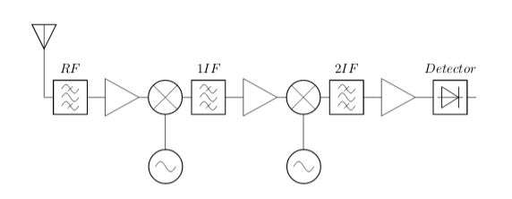

---
jupyter:
  jupytext:
    text_representation:
      extension: .Rmd
      format_name: rmarkdown
      format_version: '1.1'
      jupytext_version: 1.1.1
  kernelspec:
    display_name: Python 3
    language: python
    name: python3
---

<!-- #region -->
## Ancho de banda de ruido equivalente

Se define como ancho de banda equivalente de ruido, al ancho de banda que debería tener un dispositivo ideal para producir en la salida la misma potencia de ruido.

La potencia de ruido a la salida del dispositivo puede calcularse integrando la densidad espectral de potencia de ruido a la salida $N_{noise}*|H(f)|^2$ para todas las frecuencias, donde $|H(f)|^2$ es la ganancia de potencia del dispisitivo en función de la frecuencia (puede ser un amplificador, un filtro o un mezclador). Esta potencia tiene que coincidir con la potencia a la salida de un filtro ideal de ancho de banda $B_{eq}$ y ganancia igual a la ganancia en frecuencia central $f_{c}$. 

Esto demuestra que el ancho de banda se calcula de la siguiente forma:

$$B_{eq}=\frac{\int_{0}^{\infty} |H(f)|^2 df}{|H(f_{c})|^2}=\int_{0}^{\infty} \frac{|H(f)|^2}{|H(f_{c})|^2} df =\int_{0}^{\infty} \bar{|H(f)|^2} df$$

## Ruido en un receptor heterodino

La figura muestra un receptor heteronido de doble conversión. 




El factor de ruido del receptor se puede calcular como:


$$F_{tot}=F_{1}+\frac{F_{2}- 1}{G_{1}G_{2}}+...+\frac{F_{N} -1}{\prod_{i=1}^{N-1}G_{i}}$$

Podemos aplicar la formula de Frizz, si los anchos de banda de ruido se reducen en las sucesivas etapas. 

Dado que la incidencia del factor de ruido es inversamente proporcial a las ganancias anteriores, para la mayoria de los casos prácticos, las primeras etapas son las que definen el ruido del sistema. 

Con respecto al ancho de banda de ruido equivalente, podemos analizar los anchos de banda de ruido de cada etapa para ver como inciden en el ancho de banda total del sistema. 

En este caso, por ejemplo, si la etapa de RF esta sintoniza en $100 MHz$, su ancho de banda probablemente sea de algunos $MHz$, la etapa de primera de frecuencia intermedia tiene una frecuencia de $10.7 MHz$ con un ancho de banda de banda de cientos de $KHz$ y por último, la etapa de segunda frecuencia intermedia esta sintonizada a $455 KHz$ con un ancho de banda de decenas de $KHz$. En este sistema, la cifra de ruido se define por las primeras etapas (RF y 1FI) y el ancho de banda equivalente de ruido esta definido principalmente por la etapa de segunda FI.  


## Tres simples sintonizados sincrónicos:

$$\bar{|H(f)|^2}=\frac{1}{(1+\chi^2)^3}$$

Donde: $\chi^2=\frac{2 Q}{f_{o}} \cdot (f-f_{o})$, entonces $df= \frac{f_{o}}{2Q}d\chi$. 

El ancho de banda equivalente se calcula de esta forma

$$B_{eq}=\int_{0}^{\infty} \frac{1}{(1+\chi^2)^3} \frac{f_{o}}{2Q} d\chi$$

El ancho de banda equivalente es el ancho de banda de 3dB por $\pi/2$


$$B_{eq}=\frac{3 \cdot \pi}{16} \cdot \frac{f_{o}}{2Q}$$


## Butterwoth de tercer orden

La transferencia normalizada de un Butterwoth de orden $n$ puede expresarse como: 

$$ \bar{|H(f)|}=\frac{1}{\sqrt{1+(\frac{\chi(f)}{\chi(f_c)})^{2\cdot n}}}$$ 

donde:

$$\chi(f)   = 2 \cdot Q \cdot \frac{(f-f_o)}{f_o}$$

$$\chi(f_c) = 2 \cdot Q \cdot \frac{(f_c-f_o)}{f_o}$$

Esta transferencia corresponde a un filtro pasabajo, por lo tanto para el cálculo del ancho de banda equivalante podemos usar esta ecuación teniendo en cuenta que corresponde a la mitad del ancho de banda. 

Entonces:

$$B_{eq}=2 \cdot \int_{0}^{\infty} \frac{1}{1+(\frac{\chi(f)}{\chi(f_c)})^{6}} \frac{fo}{2Q}d\chi = \frac{fo}{Q} \cdot \chi(f_c) \cdot\frac{ \pi}{3} = 2 \cdot \frac{fo}{2Q} \cdot 2\cdot Q \frac{(f_c-f_o)}{f_o} \cdot \frac{ \pi}{3} $$

$$B_{eq}= 2 \cdot (f_c-f_o) \cdot \frac{ \pi}{3} $$


<!-- #endregion -->

```{python}

```
