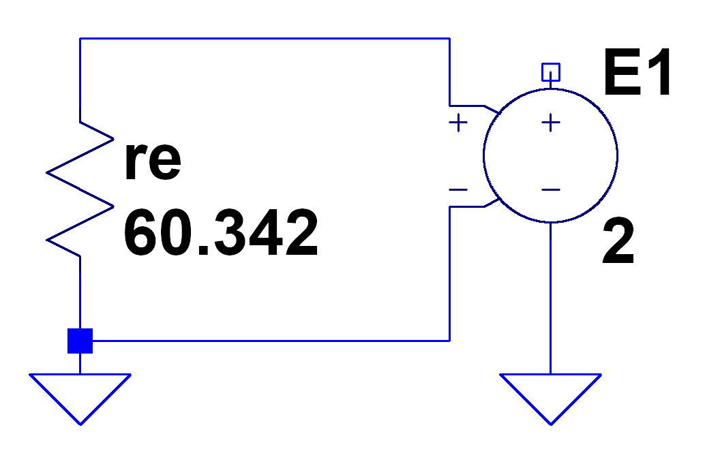
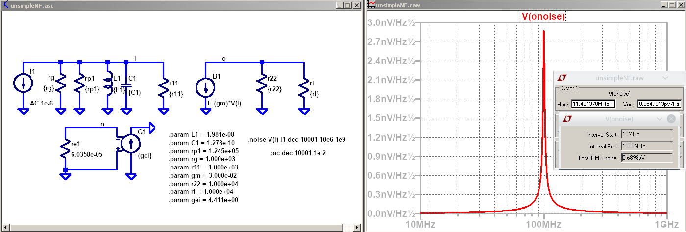

---
jupyter:
  jupytext:
    text_representation:
      extension: .Rmd
      format_name: rmarkdown
      format_version: '1.1'
      jupytext_version: 1.1.1
  kernelspec:
    display_name: Python 3
    language: python
    name: python3
---

```{python}
# Para los calculos
import numpy as np


import scipy                  # http://scipy.org/
from scipy import constants

import matplotlib.pyplot as plt
from IPython.display import Image  
# %matplotlib inline
params = {'legend.fontsize': 24,
          'figure.figsize': (12, 8),
         'axes.labelsize': 24,
         'axes.titlesize': 24,
         'xtick.labelsize':24,
         'ytick.labelsize':24}
plt.rcParams.update(params) 


```

<!-- #region -->
# Ruido Térmico en Resistores.

### Fuente de tensión de ruido blanco 

El ruido térmico es diferente del  ruido de disparo, que tiene lugar cuando el número finito de  electrones es suficientemente pequeño para dar lugar a la aparición de fluctuaciones estadísticas apreciables en una medición. La definición de ruido de Johnson-Nyquist aplica a cualquier tipo de medio conductor. Puede modelarse como una fuente de tensión que representa el ruido de una  resistencia eléctrica no ideal en serie con una  resistencia eléctrica libre de ruido. Los modelos equivalentes de un resistor se muestran en la siguiente figura.


La densidad espectral de potencia de ruido en un resistor esta dada por:

$$ N_{Res} = 4 k_B T R \,\,\,[\mathrm{V^2}/\mathrm{Hz}]$$


Donde $ k_B $ es la  constante de Boltzmann, $ T $  es la temperatura a la que se halla el resistor en grados kelvin [$K$], y $ R $ su valor en Ohmios [$\Omega$].

La constante de Boltzman toma un valor aproximado de:

$$   k_B \; \approx \; 1,38064852 \times 10^{-23}  J/K $$ 

Si queremos encontrar la potencia de ruido generada en un ancho de banda B, solo debemos multiplicar 
la densidad espectral de potencia por el mismo. Por lo tanto, el valor cuadrático medio de la tensión en el resistor esta dado por por:

$$ {\bar{v_{n}^2}} = \frac{4 hf  R B}{e^{\frac{hf}{KT}-1}} $$

Donde 

 h = Constante de Planck
 
 $k_B$ = Constante de Boltzmann 
 
 T = temperatura absoluta en Kelvin
 
 B = ancho de banda en Hz
 

 f = frecuencia central de la banda en Hz
 
 R = resistencia  
 
Es posible simplificar esta ecuación, donde es puede usarse hasta $100\,GHz$ y temperaturas mayores a los $100\,K$:


$$ {\bar{v_{n}^2}} = {4 k_B T R B} $$

<!-- #endregion -->

<!-- #region -->
### Fuente de corriente de ruido blanco 

Utilizando el teorema de Norton es posible obtener el dual de la expresión anterior para la corriente de ruido en el resistor.


$$ {\bar{i_{n}^2}} = {4 k_B T G B} $$


Donde G es la inversa de la resistencia R, su conductancia.


Observar que sucedería si fuera posible medir el valor de tensión con un instrumento de ancho de banda infinito, el valor de tensión medido seria infinito. Esto no es posible debido a que como mencionamos anteriormente, la aproximación de densidad espectral de potencia plana solo es valida hasta frecuencias cercanas a los THz, para frecuencias más altas, se debe tener en cuenta que la densidad espectral toma la siguiente forma.


$$ N_{Res}(f) = \frac{4 h f R}{e^{\frac{h f}{k_B T}} - 1} $$

La expresión anterior es similar a la expresión de la irradiancia espectral de un cuerpo negro y es así debido a la estrecha relación entre la agitación térmica de los electrones dentro de un solido y la radiación electromagnética que emite.


Para frecuencias bajas $hf << h f $ por lo tanto, la densidad espectral se reduce a la expresión $N_{Res} = 4 k_B T R$.
 
<!-- #endregion -->

<!-- #region -->
##  Simulación de la densidad de ruido espectral.

Cada resistencia ofrece en sus terminales una Potencia de ruido disponible de:

$$ k_B T B = (kT) \cdot B = (Densidad\, de\,  potencia\, de\, ruido) x (Ancho\, de\, banda) $$

La densidad de potencia de ruido es la potencia que se puede medir en cada Hz del ancho de banda. El total potencia disponible se obtiene si se multiplica esta densidad por el ancho de banda válido (o por integración sobre el ancho de banda si la densidad de potencia de ruido varía con el ancho de banda).


Pero frecuentemente se prefiere manejar voltaje en lugar de la potencia, porque es más fácil medir voltajes a diferentes frecuencias que la potencia. Entonces se usa la ecuación de potencia para operar con los dos  valores:

$$ P = \frac{V^2}{R} $$

Cuando se calcula la raíz cuadrada de la Densidad de potencia de ruido, obtendrá una expresión para la "Densidad de voltaje de ruido espectral", dada en [V/$\sqrt[]{Hz}$]. 
Si se multiplica este valor por $\sqrt[]{Hz}$, se obtiene el voltaje total de ruido. 


### Ejemplo 1

Para una resistencia de $1 K\Omega$  a $ 300 K$ el valor medio cuadrático de ruido de la tensión sobre el resistor es: 


$$ \sqrt{\bar{v_{n}^2}}= \sqrt{4 \cdot 1.38\times10^{-23} \frac{J}{K} \cdot 300\,\mathrm{K} \cdot 1~\mathrm{k}\Omega \cdot  } = 4.07  ~\mathrm{  \frac{\mu V}{\sqrt{Hz}}} $$ 

<!-- #endregion -->

```{python}
# Calculo con Jupyter
kb = constants.value('Boltzmann constant')
T  = 300
R  = 1e3

# densidad espectral de tension de ruido
v2  = (4*kb*T*R)**(1/2)  # [V/sqrt(Hz)]

# presenta los resultados 
print('Valor de tensión sobre el resistor: {:1.2e} V/(Hz)^(1/2)'.format(v2) ) 

```

## Simulación con LTspice, midiendo la densidad de tensión de ruido 


<!-- #region -->
# Cifra de ruido y Factor de ruido:

La cifra de ruido (NF) y el factor de ruido (F) son medidas de degradación de la relación señal/ruido (SNR) causada por componentes en una cadena de señal. 

El factor de ruido es, por lo tanto, la relación entre el ruido de salida real y el que se mantendría si el propio dispositivo no introdujera ruido, o la relación de la entrada SNR a la salida SNR.

$$F  =  \frac{\frac{S_i}{N_i}}{\frac{S_o}{N_o}} $$

La cifra de ruido es simplemente el factor de ruido (F) expresado en decibelios (dB).

$$NF = 10 \cdot log_{10}(\frac{SNR_i}{SNR_o}) $$ 


Operando el factor de ruido, es posible obtener otras formas de calcularlo.

$$ F = \frac{ S_i \cdot N_o}{ S_o \cdot  N_i} $$

$$ F = \frac{ S_i \cdot N_o}{ G \cdot S_i \cdot N_i} $$

La potencia de ruido a la salida $N_o$ puede ser expresar como $N_o = G N_o + N_e$, entonces:   

$$ F = \frac{  G \cdot N_i + N_e }{ G \cdot N_i} $$

$$ F =  1 + \frac{ N_e }{ G \cdot N_i} $$

$N_e$ es la potencia en exceso a la salida y  se puede calcular como:

$$ N_{ei} =  (F - 1) \cdot  G \cdot N_i $$

Para un circuito paralelo (modelo admitancia), la potencia adicional puede ser suministrada por una fuente de corriente.

$$ i_{ei}^2 \cdot Rto =  (F - 1) \cdot  G \cdot i_i^2 \cdot Rti $$

$$ i_{ei} =  \sqrt{(F - 1) \frac{Rti}{Rto} \dot G } \cdot   i_i  $$

donde $i_i = \sqrt{4\cdot k_b \cdot T \cdot B \cdot \frac{1}{R} }$


Si la fuente $N_e$ esta en la entrada, $N_e = G \cdot N_ei$

$$ F = 1 + \frac{G \cdot N_{ei} }{ G \cdot N_i} $$

$$ F =  1 + \frac{ N_{ei} }{ N_i} $$

La potencia $N_{ei} $ corresponde a una potencia de ruido excedente que se presenta en la entrada y  se puede calcular como:

$$ N_{ei} =  (F - 1) \cdot   N_i $$


Para un circuito paralelo (modelo admitancia), la potencia adicional puede ser suministrada por una fuente de corriente.

$$ i_{ei}^2 \cdot Rti =  (F - 1) \cdot   i_i^2 \cdot Rti $$

$$ i_{ei} =  \sqrt{(F - 1) } \cdot   i_i  $$

donde $i_i = \sqrt{4\cdot k_b \cdot T \cdot B \cdot \frac{1}{R} }$


<!-- #endregion -->

<!-- #region -->
## Fuentes de ruido en LTspice

No parece haber una forma directa de agregar un ruido de voltaje o una fuente de ruido de corriente a un circuito LTspice (u otro tipo de Spice) para ser usado en una simulación de ruido. Sin embargo, es posible agregar fuentes de ruido para usar en simulaciones .tran (dominio del tiempo) utilizando fuentes de comportamiento.  
Un método para agregar ruido blanco (Johnson y disparo) y 1/f voltaje(flicker) o fuentes de ruido de corriente de la amplitud deseada para usar en simulaciones de ruido (.noise).

Un caso en el que dichas fuentes de ruido pueden ser útiles es cuando se realizan modelos de simulación de amplificadores  donde se conoce el voltaje de entrada referido y los ruidos de corriente a partir de la hoja de datos.
La única fuente de ruido simple (que afecta a las simulaciones de ruido) en LTspice es una resistencia simple. Existen otras fuentes de ruido en los modelos de dispositivos semiconductores, pero esos modelos son más complejos. Una resistencia ideal tiene un ruido de voltaje descrito por:

$$ Vrms  = \sqrt{4 \cdot k_B \cdot T \cdot R \cdot B } $$

donde $k_B$ es la constante de Botzmann ($1.381\times 10^{-23} J/K$), $T$ es la temperatura en Kelvin (300 K por defecto en LTspice), $B$ es el ancho de banda en [Hz] y R es La resistencia en [$\Omega$].
En las hojas de datos de los transistores o amplificadores generalmente especifica el ruido de voltaje blanco en unidades de $[\frac{nV}{\sqrt{Hz}}]$ y el ruido de corriente en $[\frac{pA}{\sqrt{Hz}}]$ (a veces $[\frac{fA}{\sqrt{Hz}}]$).

Para crear una fuente de ruido de voltaje blanco, podemos conectar los terminales de entrada de una fuente de voltaje dependiente de voltaje a una resistencia y usar un factor de escala adecuado. La fuente dependiente aísla la resistencia de cualquier circuito que esté conectado a ella y preserva la amplitud de ruido de voltaje independientemente de la carga.
Dado que las fuentes de ruido generalmente se especifican en nV/√Hz,  es conveniente poder ingresar ese número directamente como parte del modelo. Una forma simple de hacerlo es seleccionando una resistencia que produce una densidad de ruido de 1 $\frac{nV}{\sqrt{Hz}}$ e ingrese la amplitud de ruido de la hoja de datos como la ganancia de voltaje de la fuente dependiente. Resolviendo la ecuación anterior para $v_n = 1 nV$ cuando $T = 300 K$ y $B = 1 Hz$ da $R = 60.342$.

El esquema de la especificación LTspice resultante para una fuente de ruido de voltaje de 2 $\frac{nV}{\sqrt{Hz}}$ es así:




De manera similar, para crear una fuente de ruido de corriente blanca, podemos usar una fuente de corriente dependiente de voltaje ( Fuente de G). 
Para establecer el factor de transconductancia de la fuente a la densidad de ruido en $[\frac{pA}{\sqrt{Hz}}]$, es necesaria una resistencia con una densidad de ruido de 1 $\frac{pA}{\sqrt{Hz}}$, lo que significa que la resistencia tendrá un valor de $60.342e-6 $. 
 
Una fuente de ruido de corriente con una densidad de ruido de 2 $\frac{pA}{\sqrt{Hz}}$ se puede modelar así:


<!-- #endregion -->

## Ejemplo de Factor de ruido en amplificadores

Suponiendo un transistor con cifra de ruido de $3 dB$, calcular la corriente en excedo de la fuente del transistor. 

Parametros del transistor: 
$r_{11} = 1 K\Omega$, 
$g_m    = 100 mS$, 
$r_{22} = 10 k \Omega$.

```{python}
# Ejemplo de calculo de la fuente de corriente en exceso de ruido  

NF = 3 # dB
F  = 10**(NF/10) 

# Empleando solo la parte resistiva del transistor
r11= 1e3
gm = 100e-3
r22= 10e3

# MTE
rg = r11
rl = r22

# Resistencia total entrada
rti= r11*rg/(r11+rg)
# Resistencia total salida
rto= r22*rl/(r22+rl)

# Ganancia de tension
Av = gm * rto

# Ganancia de Potencia
G = Av**2 * (r11/rl)

# Ruido en la entra dado las resistencia de entrada
T  = 300
B  = 1
kb = constants.value('Boltzmann constant')

#####################################
### Fuente de corriente de ruido en exceso en la entrada
#####################################
ii   = (4*kb*T*B/rti)**(1/2)
# si la fuente de ruido esta en la entrada la corriente de ruido ie
iei = (F - 1)**(1/2)  *  ii 

#####################################
### Fuente de corriente de ruido en exceso en la salida
#####################################
# F = (1 + Ne/(G*Ni))
ii   = (4*kb*T*B/rti)**(1/2)
ieo = ((F - 1)*G*rti/rto)**(1/2)*ii   


## Para las simulaciones con LTspice
gei = iei/1e-12
geo = ieo/1e-12

print('.param rg = {:1.3e}'.format(rg))
print('.param rl = {:1.3e}'.format(rl))
print('.param r11 = {:1.3e}'.format(r11))
print('.param r22 = {:1.3e}'.format(r22))
print('.param gm = {:1.3e}'.format(gm))

print('.param gei = {:1.3e}'.format(gei))
print('.param geo = {:1.3e}'.format(geo))

```

<!-- #region -->
### Medición de la potencia de ruido en la entrada sin ruido en exceso
Se mide la potencia de ruido en la entrada. Esta potencia de ruido es suminstrada por las resistencias del nodo de entrada (generador y transistor).


De la medición, la tensión espectral de ruido en la entrada es:

$V_n =  \sqrt{4\cdot k_b \cdot T \cdot r_{ti} } = 2.87 \frac{n V}{\sqrt{Hz}}$

El valor de tensión rms ($ 1 Hz$ de ancho de banda):

$V_{rms} = 2.87 \frac{n V}{\sqrt{Hz}} \cdot 1 Hz = 2.87 n V$

La potencia de ruido en la entrada del transistor:

$N_{i} =  \frac{ (V_{rms})^2}{r_{11}} = \frac{ (2.87 n V)^2}{1K\Omega} = 8.28\times 10^{-21} W$


### Medición de la potencia de ruido en la salida sin ruido en exceso


De la medición, la tensión espectral de ruido en la entrada es:

$V_n =  \sqrt{4\cdot k_b \cdot T \cdot r_{ti} } = 1.44 \frac{\mu V}{\sqrt{Hz}}$

El valor de tensión rms ($ 1 Hz$ de ancho de banda):

$V_{rms} = 1.44 \frac{\mu V}{\sqrt{Hz}} \cdot 1 HZ = 1.44 \mu V$

La potencia de ruido en la resistencia de salida $r_l$ :

$N_{o} =  \frac{ (V_{rms})^2}{r_{l}} = \frac{ (1.44 \mu V)^2}{10K\Omega} = 2.07\times 10^{-16}  W$

### Ganancia de potencia

$G = \frac{N_o}{N_i} = \frac{2.07\times 10^{-16}}{8.23\times 10^{-21}} = 25.1 \times 10^{3}$

Analiticamente la ganancia de potencia $G$  se puede calcular como:

$G = |Av|^2 \cdot \frac{rl}{r11}  = (gm \cdot r_{to})^2 \cdot \frac{rl}{r11} = 25 \times 10^{3}$


### Medición del Factor de ruido con ruido en exceso en la entrada


De la medición, la tensión espectral de ruido en la salida es:

$V_n =  \sqrt{4\cdot k_b \cdot T \cdot r_{ti} } = 2.03 \frac{\mu V}{\sqrt{Hz}}$

El valor de tensión rms ($ 1 Hz$ de ancho de banda):

$V_{rms} = 2.03 \frac{\mu V}{\sqrt{Hz}} \cdot 1 HZ = 2.03 \mu V$

La potencia de ruido en la resistencia de salida $r_l$ :

$N_{o} =  \frac{ (V_{rms})^2}{r_{l}} = \frac{ (2.03 \mu V)^2}{10K\Omega} = 4.12\times 10^{-16}  W$

El Factor de poptencia:

$F = \frac{N_{o}}{G \cdot N_{i}} = \frac{4.12\times 10^{-16}  W}{ 25\times 10^{3}  \cdot 8.28\times 10^{-21} W} = 2$


### Medición del Factor de ruido con ruido en exceso en la salida


De la medición, la tensión espectral de ruido en la salida es:

$V_n =  \sqrt{4\cdot k_b \cdot T \cdot r_{ti} } = 2.03 \frac{\mu V}{\sqrt{Hz}}$

El valor de tensión rms ($ 1 Hz$ de ancho de banda):

$V_{rms} = 2.03 \frac{\mu V}{\sqrt{Hz}} \cdot 1 HZ = 2.03 \mu V$

La potencia de ruido en la resistencia de salida $r_l$ :

$N_{o} =  \frac{ (V_{rms})^2}{r_{l}} = \frac{ (2.03 \mu V)^2}{10K\Omega} = 4.12\times 10^{-16}  W$

$F = \frac{N_{o}}{G \cdot N_{i}} = \frac{4.12\times 10^{-16}  W}{ 25\times 10^{3}  \cdot 8.28\times 10^{-21} W} = 2$


#### Nota: en estos calculos se despreciaron los ruidos aportados por las resistencias en la salida.
<!-- #endregion -->

<!-- #region -->
# Factor de ruido en dispositivos conectados en cascada.

La fórmula de Friis se utiliza para calcular el factor de ruido total de una cascada de etapas, cada una con su propio factor de ruido y ganancia de potencia (suponiendo que las impedancias se combinan en cada etapa). 


El factor de ruido total se puede utilizar para calcular la cifra de ruido total. 

El factor de ruido total se da como

$$F = F_1 + \frac{F_2-1}{G_1} + \frac{F_3-1}{G_1 \cdot G_2} + ... + \frac{F_n -1}{G_1\cdot G_2 ... \cdot G_{n-1}} $$

#### Demostración

Suponiendo el sistema que se muestra en la figura, la potencia de señal a la salida se calcula como (suponiendo que el calculo de potencia tiene en cuenta la impedancia de entrada y de salida de las distintas etapas del sistema):

$$ S_o = S_i \cdot G_1 \cdot G_2 \cdot G3 $$

La potencia de ruido N_o en este caso sera:

$$ N_o = N_i \cdot G_1 \cdot G_2 \cdot G_3 + N_{a1} \cdot G_2 \cdot G_3 + N_{a2} \cdot G3 + N_{a3}   $$ 

El factor de ruido entonces:

$$ F = \frac{\frac{S_i}{N_i}}{\frac{S_o}{N_o}} $$

$$ F = \frac{S_i \cdot (N_i \cdot G_1 \cdot G_2 \cdot G_3 + N_{a1} \cdot G_2 \cdot G_3 + N_{a2} \cdot G3 + N_{a3}  ) }{N_i \cdot (S_i \cdot G_1 \cdot G_2 \cdot G3 )} $$

$$F = F_1 + \frac{F_2-1}{G_1} + \frac{F_3-1}{G_1 \cdot G_2} + ... + \frac{F_n -1}{G_1\cdot G_2 ... \cdot G_{n-1}} $$


### Factor de ruido de una red con pérdidas.

A temperatura ambiente, el factor de ruido de una red con pérdidas es igual a su pérdida de potencia.

La potencia de ruido en la entrada del atenuador debido a una fuente perfectamente adaptada a la temperatura ($T$) viene dada por

$$ N_i = k_B \cdot T \cdot B  $$


La densidad espectral de potencia de ruido de entrada es

$$ \frac{N_i}{B}  = k_B \cdot T $$

Cuando una señal ruidosa pasa a través del atenuador, la potencia de ruido se atenúa de la misma manera que la potencia de la señal ($G = \frac{1}{L}$). Entonces, la densidad espectral de potencia del ruido en la salida es

$$ \frac{N_o}{B} = \frac{N_i}{L \cdot B} = \frac{k_B  \cdot T}{L \cdot B}$$

donde $L = 10^{L_{dB}/10}$

Solo sale una parte del ruido, y el resto se disipa en el atenuador. Bajo el supuesto de que el atenuador está en equilibrio térmico, no sale calor por el atenuador debido al gradiente de temperatura.

El calor disipado en el atenuador es equivalente al exceso de potencia de ruido (N_e) en el atenuador.

$$ \frac{N_e}{B} =  \frac{N_i}{B} - \frac{N_o}{B} =  \frac{N_i}{B} \cdot ( 1 - \frac{1}{L}  ) $$

Factor de ruido del atenuador,

$$ F = 1 + \frac{   N_e }{ G \cdot N_i}  = $$

$$ F = 1 + \frac{ N_i \cdot ( 1 - \frac{1}{L}  )   }{ G \cdot N_i}  = $$

$$ F = 1 + L \cdot ( 1 - \frac{1}{L}  )  $$

$$ F =  L $$ 
<!-- #endregion -->

<!-- #region -->
# Ancho de banda equivalente

Hasta el momento el analisis realizado permite el calculo de la densidad espectral de ruido. Para conocer la potenica de ruido es necesario conocer el ancho de banda de los circuitos. 

A continuación se analiza el ancho de banda de circuitos con impedacias complejas y luego, circuitos sintonizados. 

## Impedancias complejas

Nyquist determinó que la densidad espectral de ruido generado en una impedancia solo depende del valor resistivo de la impedancia (Parte real). El valor de tensión cuadrático medio en bornes de la impedancia se calcula integrando la densidad espectral sobre el ancho de banda de interés. El cálculo de la tensión de ruido tiene la siguiente expresión.


$$ {\bar{v_{n}^2}} = {4 k_B T \int_{B} R(f) df} $$


La expresión anterior equivale tener infinitas resistencias de  valor $R(f)$ que solo aportan ruido en un diferencial tensión cuadrática media $4 k_B T R(f) df$ centrado en $f$.

Para fijar conocimientos, consideremos un resistor en paralelo con un capacitor.


El valor de impedancia en bornes se calcula:

$$ Z(f) = \frac{R}{1+j\omega R C} $$


Donde


$$ Re [Z(f)] = R(f) = \frac{R}{ 1+ (\omega R C)^2 } $$


Por lo tanto, para conocer el valor cuadrático medio de la tensión de ruido a la salida debemos resolver la siguiente integral

$$ {\bar{v_{n}^2}} = {4 k_B T R \int_{B} \frac{1}{ 1+ (2 \pi f R C)^2} df} $$


Observar que la constante que multiplica a la integral tiene unidades de $V^2/Hz$, por lo tanto, la integral debe tener unidades de $Hz$. Más adelante veremos que esta integral determina el ancho de banda de ruido equivalente y esta dado pros la respuesta en frecuencia del circuito. Para resolver la siguiente integral, debemos conocer el ancho de banda sobre el que queremos medir el ruido, supongamos que poseemos un instrumento de ancho de banda infinito y queremos verificar el nivel de ruido,la integral que debemos resolver es:

$$ {\bar{v_{n}^2}} = {4 k_B T R \int_{0}^{\infty} \frac{df}{ 1+ (2 \pi f R C)^2} } $$

Recurriendo a una tabla de integrales entonces:

$$ {\bar{v_{n}^2}} = \frac{k_B T}{C}  $$

Sabiendo que para un filtro RC, la frecuencia de corte se halla en $f_{-3db}=\frac{1}{2 \pi R C}$. La tensión cuadrática media de ruido toma la expresión:

$$ {\bar{v_{n}^2}} = {4 k_B T R (\frac{\pi}{2} f_{-3db})} $$

Donde el término entre paréntesis es el denominado ancho de banda equivalente de ruido.

<!-- #endregion -->

```{python}
# Ejemplo de calculo de potencia de ruido
# RC en paralelo
## Calculo con Jupyter

kb = constants.value('Boltzmann constant')
T  = 300  # K
R  = 1e3  # ohm 
C  = 1e-9 # F


# Potencia de ruido
Prms  = (kb*T/C)/R  # [V/sqrt(Hz)]

print('Potencia de ruido sobre el resistor: {:1.2e} W'.format(((Prms))))

Vrms  = (Prms*R)**(1/2)
print('Valor cuadratico medio de la tensión sobre el resistor: {:1.2e} V'.format(Vrms) ) 

```

### Medición con LTspice


Valor cuadratico medio de la tensión sobre el resistor: 2.04e-06 V

Potencia de ruido sobre el resistor: 

$$P = 4.14 \times 10^{-15} W $$


<!-- #region -->
# Ancho de banda equivalente en circuitos sintonizados

Tanto el ruido térmico como el de disparo poseen densidades espectrales planas. Se define como ancho de banda equivalente de ruido de un sistema, al ancho de banda que debería tener un dispositivo ideal para producir en la salida la misma potencia de ruido. Esto re representa gráficamente en la siguiente imagen.


La potencia de ruido a la salida del dispositivo puede calcularse integrando la densidad espectral de potencia de ruido a la salida $N_{noise}*|H(f)|^2$ para todas las frecuencias, donde $|H(f)|^2$ es la ganancia de potencia en función de la frecuencia del dispositivo (puede ser un amplificador, un filtro o un mezclador). Esta potencia tiene que coincidir con la potencia a la salida de un filtro ideal de ancho de banda $B_{eq}$ y ganancia igual a la ganancia en frecuencia central $f_{c}$. Esto se expresa matemáticamente de esta forma:

$P_{out}=\int_{-\infty}^{\infty} N_{0} \cdot |H(f)|^2 df= N_{0} \cdot |H(f_{c})|^2\int_{-B_{eq}/2}^{B_{eq}/2} df$

Donde $N_{noise}$ es la densidad espectral de ruido y una constante. Resolviendo la integral en el termino derecho se obtiene:

$N_{0} \int_{-\infty}^{\infty} |H(f)|^2 df= N_{0} \cdot |H(f_{c})|^2 B_{eq}$

Esto demuestra que el ancho de banda se calcula de la siguiente forma:

$B_{eq}=\frac{\int_{-\infty}^{\infty} |H(f)|^2 df}{|H(f_{c})|^2}=\int_{-\infty}^{\infty} \frac{|H(f)|^2}{|H(f_{c})|^2} df =\int_{-\infty}^{\infty} \bar{|H(f)|^2} df$

### Ancho de banda equivalente de  un simple sintonizado

Para demostrar la aplicación de este concepto,calculemos el ancho e banda equivalente de ruido
de un amplificador sintonizado. El mismo tiene la siguiente respuesta en frecuencia normalizada:

$$ \bar{|H(f_{c})|^2}=\frac{1}{1+\chi^2}$$

Donde: $\chi^2=\frac{2 Q}{f_{c}} \cdot (f-f_{c})$, entonces $df= \frac{f_{c}}{2Q}d\chi$. El ancho de banda equivalente se calcula de esta forma

$$ B_{eq}=\int_{-\infty}^{\infty} \frac{1}{1+\chi^2} \frac{f_{c}}{2Q}d\chi $$

Este resultado es el mismo que el del filtro RC calculado anteriormente. El ancho de banda equivalente es el ancho de banda de 3dB por $\pi/2$

$$ B_{eq}=\frac{\pi}{2} \cdot f_{3dB}=\frac{\pi}{2}\frac{f_{c}}{Q}$$


###  Ancho de banda equivalente de dos simples sintonizados sincronicos y de igual Q

$$\bar{|H(f_{c})|^2}=\frac{1}{(1+\chi^2)^2}$$

Donde: $\chi^2=\frac{2 Q}{f_{c}} \cdot (f-f_{c})$, entonces $df= \frac{f_{c}}{2Q}d\chi$. El ancho de banda equivalente se calcula de esta forma

$$B_{eq}=\int_{-\infty}^{\infty} \frac{1}{(1+\chi^2)^2} \frac{f_{c}}{2Q}d\chi $$

Este resultado es el mismo que el del filtro RC calculado anteriormente. El ancho de banda equivalente es el ancho de banda de 3dB por $\pi/2$

$$B_{eq}=\frac{\pi}{4} \cdot f_{3dB}=\frac{\pi}{4}\frac{f_{c}}{Q}$$


###  Ancho de banda equivalente de un doble sintonizados


En el caso de un amplificador doble sintonizado, la transferencia normalizada es:

$$ \bar{|H(f_{c})|^2}=  \frac{1}{1+\frac{\chi^4}{4}} $$

$$ B_{eq}=\frac{\pi}{2} \cdot f_{3dB}=\frac{\pi}{2}\frac{f_{c}}{Q}$$

<!-- #endregion -->

## Ejemplo Simple  Sintonizado empleando transistor con cifra de ruido $ NF = 2 dB $.

Calcular el ancho de banda equivalente de un amplificador simple sintonizado. Calcular para máxima transferencia de energía. Suponer que el aporte de la fuente de ruido en exceso se encuentra en la entrada.

Datos:
$f_o  = 100 MHz$

$Q_c  = 40$

$Q_o = inf$  

Transistor: 
$y11= 1.0 mS$,
$y12= 0.0 mS$, 
$y21= 30.0 mS$, 
$y22= 0.1 mS$.

```{python}
## Ejemplo con calculo en Python
# simple sintonizado de 100MHz
# Frecuencia de operación
fo = 100e6
wo= 2*np.pi*fo

kb = constants.value('Boltzmann constant')
# Temperatura en Kelvin
T  = 300

# Parametros del transistor 100 MHz
y11 =   1.0e-3 
y12 =   0.0
y21 =  30.0e-3  
y22 =   0.1e-3 
# Cifra de ruido del transistor
NF  = 2 # dB 
F   = 10**(NF/10) # Factor de ruido del transistor 


Q1  = 40                      # Q cargado del sintonizado
Qo  = 10000                   # Q libre de perdidas

rg   = 1/y11.real             # Resistencias del generador
r11  = 1/y11.real             # resistencia de entrada 
gm   = abs(y21)               # gm del transistor
r22  = 1/y22.real             # resistencia de salida
rl   = 1/y22.real             # Resistencia de carga

rext = rg/2                   # resistencia externa para el calculo del inductor
L1   = (1/Q1 - 1/Qo)*rext/wo  # Calculo del inductor
C1   = 1/(wo**2 * L1)         # Capacitor de sintonia
rp1  = Qo * wo * L1           # Resistencia de perdida

rti  = Q1*wo*L1               # resistencia total en el nodo de entrada (incluye sintonizado)
rto  = r22*rl/(r22 + rl)      # resistencia total en el nodo de salida (no tiene sintonizado)  
Av   = gm * rto               # Ganancia de tension
G    = Av**2 * r11/rl         # Ganancia de potencia
print('Ganancia de potenica: {:1.2e} V'.format(G) ) 


Beq1 = (np.pi/2)*(fo/Q1)      # Ancho de banda equivalente del sintonizado
print('Ancho de banda equivalente: {:1.2e} Hz '.format(Beq1) ) 

# Calculo de la fuentes de corriente de ruido 
iib   = (4*kb*T/rti)**(1/2) ## Corriente de ruido dadas las resistencias en la entrada 
Ni   =  iib**2* Beq1 *r11      # N Potencia de ruido de entrada
print('Potencia de ruido de entrada Ni: {:1.2e} W'.format(Ni)) 

iei    = (F - 1)**(1/2)  *  iib  ## Fuente de corriente de ruido en exceso en la entrada
# Si la fuente se encuetra en el nodo de salida 
#ieo    = ((F - 1)*G*rti/rto)**(1/2)*ii   

inoise = (iib**2 + iei**2)**(1/2)   # Corriente total en el nodo de entrada 
print('Valor cuadratico medio de la corriente sobre el resistor de entrada: {:1.2e} V'.format(inoise) ) 

No    = G * (inoise**2 * Beq1 * r11)
print('Potencia de ruido sobre el resistor de salida: {:1.2e} W'.format(No)) 

F     = No/(G*Ni)
print('F : {:1.2e} '.format(F)) 
NF    = 10 * np.log10(F)
print('NF : {:1.2e} '.format(NF)) 
```

```{python}
## Parametros de LTspice
# para usar en LTspice. Presionar s y pegar en el cuadro de dialogo.
# Los valores de los componentes se asignan entre llaves. 

## Para las simulaciones con LTspice
gei = iei/1e-12


print('.param L1 = {:1.3e}'.format(L1))
print('.param C1 = {:1.3e}'.format(C1))
print('.param rp1 = {:1.3e}'.format(rp1))
print('.param rg = {:1.3e}'.format(rg))
print('.param r11 = {:1.3e}'.format(r11))
print('.param gm = {:1.3e}'.format(gm))
print('.param r22 = {:1.3e}'.format(r22))
print('.param rl = {:1.3e}'.format(rl))
print('.param gei = {:1.3e}'.format(gei))

```

### Medición con LTspice



Valor cuadratico medio de la tensión en el nodo de entrada: 5.5858e-6 V

Potencia de ruido sobre el resistor $r11$: 

$$Ni = \frac{vni^2}{r11} =  3.12 \times 10^{-14} W $$


Valor cuadratico medio de la tensión en el nodo de entrada: 1.11e-3 V

Potencia de ruido sobre el resistor $rl$: 

$$No = \frac{vno^2}{rl} =  4.66 \times 10^{-10} W $$


<!-- #region -->
## Ejemplo Dos Simples  Sintonizados empleando transistor con factor de ruido $ F = 2 $.

Calcular el ancho de banda equivalente de un amplificador simple sintonizado que tiene dos sintonizados. Calcular para máxima transferencia de energía. 

Datos:
$f_o  = 100 MHz $

$Q_{c1}  = 40 $
$Q_{c2}  = 40 $


$Q_o = inf$  

Transistor: 
$y11 =   1.0\times 10^{-3}S$,
$y12 =   0.0S$, 
$y21 =  30.0\times 10^{-3}S$, 
$y22 =   0.1\times 10^{-3}S$.
<!-- #endregion -->

```{python}
## Ejemplo con calculo en Python
# simple sintonizado de 100MHz
# Frecuencia de operación
fo = 100e6
wo= 2*np.pi*fo

kb = constants.value('Boltzmann constant')
# Temperatura en Kelvin
T  = 300

# Parametros del transistor 100 MHz
y11 =   1.0e-3 
y12 =   0.0
y21 =  30.0e-3  
y22 =   0.1e-3 
# Cifra de ruido del transistor
NF  = 2 # dB 
F   = 10**(NF/10) # Factor de ruido del transistor 


Q1  = 40                      # Q cargado del sintonizado
Q2  = 40                      # Q cargado del sintonizado
Qo  = 10000                   # Q libre de perdidas

rg   = 1/y11.real             # Resistencias del generador
r11  = 1/y11.real             # resistencia de entrada 
gm   = abs(y21)               # gm del transistor
r22  = 1/y22.real             # resistencia de salida
rl   = 1/y22.real             # Resistencia de carga

## Entrada
rext = rg/2                   # resistencia externa para el calculo del inductor
L1   = (1/Q1 - 1/Qo)*rext/wo  # Calculo del inductor
C1   = 1/(wo**2 * L1)         # Capacitor de sintonia
rp1  = Qo * wo * L1           # Resistencia de perdida
rti  = Q1*wo*L1               # resistencia total en el nodo de entrada (incluye sintonizado)

## Salida
rext = r22/2                  # resistencia externa para el calculo del inductor
L2   = (1/Q2 - 1/Qo)*rext/wo  # Calculo del inductor
C2   = 1/(wo**2 * L2)         # Capacitor de sintonia
rp2  = Qo * wo * L2           # Resistencia de perdida
rto  = Q2*wo*L2               # resistencia total en el nodo de salida (no tiene sintonizado)  


Av   = gm * rto               # Ganancia de tension
G    = Av**2 * r11/rl         # Ganancia de potencia
print('Ganancia de potenica: {:1.2e} V'.format(G) ) 


# Ancho de banda equivalente para las fuentes de ruido en la entrada del sintonizado
Beq1  = (np.pi/2)*(fo/Q1)      
print('Ancho de banda equivalente de la entrada: {:1.2e} Hz '.format(Beq1) )
# Ancho de banda equivalente para las fuentes de ruido en la salida del sintonizado
Beq2  = (np.pi/2)*(fo/Q2)      
print('Ancho de banda equivalente de la salida: {:1.2e} Hz '.format(Beq2) ) 

# Ancho de banda equivalente para las fuentes de ruido de la entrada del sintonizado
Beq1o = (np.pi/4)*(fo/Q1) 
print('Ancho de banda equivalente: {:1.2e} Hz '.format(Beq1o) ) 


# Calculo de la fuentes de corriente de ruido 
iib   = (4*kb*T/rti)**(1/2) ## Corriente de ruido dadas las resistencias en la entrada 
Ni    =  iib**2* Beq1o *r11      # N Potencia de ruido de entrada
print('Potencia de ruido de entrada Ni: {:1.2e} W'.format(Ni)) 

iei    = (F - 1)**(1/2)  *  iib  ## Fuente de corriente de ruido en exceso en la entrada
# Si la fuente se encuetra en el nodo de salida 
ieo    = ((F - 1)*G*rti/rto)**(1/2)*iib   

inoise = (iib**2 + iei**2)**(1/2)   # Corriente total en el nodo de entrada 
print('Valor cuadratico medio de la corriente sobre el resistor de entrada: {:1.2e} A'.format(inoise) ) 

No    = G * (inoise**2 * Beq1o * r11)
print('Potencia de ruido sobre el resistor de salida: {:1.2e} W'.format(No)) 

F     = No/(G*Ni)
print('F : {:1.2e} '.format(F)) 
NF    = 10 * np.log10(F)
print('NF : {:1.2e} '.format(NF)) 
```

```{python}
## Parametros de LTspice
# para usar en LTspice. Presionar s y pegar en el cuadro de dialogo.
# Los valores de los componentes se asignan entre llaves. 

## Para las simulaciones con LTspice
gei = iei/1e-12
geo = ieo/1e-12

print('.param rg = {:1.3e}'.format(rg))
print('.param L1 = {:1.3e}'.format(L1))
print('.param C1 = {:1.3e}'.format(C1))
print('.param rp1 = {:1.3e}'.format(rp1))
print('.param gei = {:1.3e}'.format(gei))
print('.param geo = {:1.3e}'.format(geo))
print('.param r11 = {:1.3e}'.format(r11))
print('.param gm = {:1.3e}'.format(gm))
print('.param r22 = {:1.3e}'.format(r22))
print('.param L2 = {:1.3e}'.format(L2))
print('.param C2 = {:1.3e}'.format(C2))
print('.param rp2 = {:1.3e}'.format(rp2))
print('.param rl = {:1.3e}'.format(rl))

```

<!-- #region -->
## Medición con LTspice


Valor cuadratico medio de la tensión en el nodo de entrada: 5.5858e-6 V

Potencia de ruido sobre el resistor $r11$: 

$$Ni = \frac{vni^2}{r11} =  3.12 \times 10^{-14} W $$


Valor cuadratico medio de la tensión en el nodo de entrada: 757e-6 V

Potencia de ruido sobre el resistor $rl$: 

$$No = \frac{vno^2}{rl} =  5.73 \times 10^{-11} W $$


Valor cuadratico medio de la tensión en el nodo de entrada: 885e-6 V

Potencia de ruido sobre el resistor $rl$: 

$$No = \frac{vno^2}{rl} =  7.85 \times 10^{-11} W $$


#### Nota

La diferencia entre los dos metodos radica en que la fuente de corriente de ruido en la entrada se filtra por dos sintonizados, lo que da un ancho de banda equivalente de ruido de $\frac{\pi}{4}$, en cambio, al estar en la salida, el ancho de banda equivalente es de $\frac{\pi}{2}$.
<!-- #endregion -->

```{python}

```
